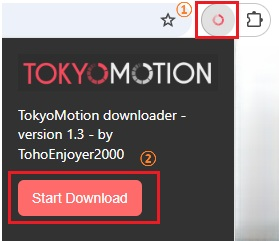

# TokyoMotion Downloader


*Downloader* 
:)
<hr>
A chrome extension to download tokyomotion video directly from browser, via cURL or Aria2.

**Unlike youtube-dl this is able to download HD video.**

<hr>

## Main Features (Updated Nov 2025)
- Download videos from the popup window
- Easy operation from the extension button

You can download videos by opening them on one of the following sites and clicking “Start Download” in the popup window:

- "https://www.tokyomotion.net/*",
- "https://www.osakamotion.net/*",


## Build
```sh
npm i
npm run build

# built files in dist directory
```

## Installation

The avaible settings are currently only:
-   Go to chrome extensions tab
-   Activate developer mode
-   Load unpacked extension
-   select tokyomotion-crx folder (manifetst.json folder)

*by TohoEnjoyer2000*